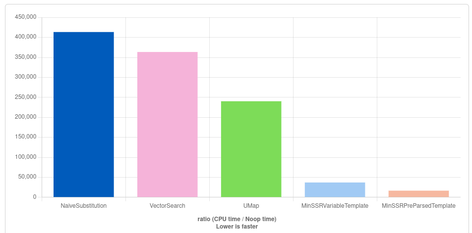

# Micro-optimized Template Processing in C++
> 2026.7.21

In this video/blog post I'll walk you though the process of how I created a highly-optimized C++ template processor.
In addition to standard algorithm analysis and optimization techniques, this involved leveraging constexpr and analysis
of compiler output.

[](https://quick-bench.com/q/dRs5IEzl4tNya_y1e7_bSeQat-0)

The resulting library is dramatically faster than naive string substitution and performs substantially better than
commonly used templating libraries, although with limited features.

## Background
### What is a template processor?
Put simply, [template processors](https://en.wikipedia.org/wiki/Template_processor) take a template and data as inputs and generate a document, program, etc.

So for example, if you have a website where each user gets their own "about" page, you could use a template processor to generate this page for each user.

```html
<ul>
    <li>Name: {{display_name}}</li>
    <li>Username: {{user_name}}</li>
    <li>Email: {{user_email}}</li>
    <li>Bio: {{bio}}</li>
<ul> 
```

```cpp
std::string user_page(const User& user) {
    mustache page{get_user_page_template()};
    mustache::data data;
    data.set("display_name", user.display_name);
    data.set("user_name", user.user_name);
    data.set("user_email", user.email);
    data.set("bio", user.bio);
    return page.render(data);
} 
```


### Existing Solutions
There are many mature template languages with libraries for multiple langauges that make development easy for most people.
So, because this was a minor component of a bigger project, I started out using a library with a bunch of GitHub stars, a
sophistocated template language, lots of features I didn't need, and some defaults I didn't like. But at least it worked.

Eventually I wanted to "partially render" a template with some global values so that they wouldn't have be rendered for
each page. But according to the library maintainers there was no easy way to do that because it always removes unknown
tags ... which I also didn't like. So, considering I was only using it to replace substrings I decided to just roll my own
solution instead of using an ugly workaround.

## A Template Processor From Scratch
Because making a template processor wasn't my main goal, I threw something together quickly and made gradual improvements
over time. I've tried to capture this process here as it includes some things most developers don't usually think about.

### Naive Substring Replacement
So at first I started out with something really simple that replaces tags with substitutions in a string.

```cpp
void replace_all(
	std::string& haystack,
	const std::string_view needle,
	const std::string_view replacement
) {
    std::size_t i = 0;
    while ((i = haystack.find(needle, i)) != std::string::npos) {
        haystack.replace(i, needle.size(), replacement);
        i += replacement.size();
    }
}

static const html_template = read_file_as_string("template.html");

std::string ret = html_template;
replace_all(ret, "{{a}}", get_replacement(1) );
replace_all(ret, "{{bb}}", get_replacement(2) );
replace_all(ret, "{{ccc}}", get_replacement(3) );
replace_all(ret, "{{dddd}}", get_replacement(4) );
replace_all(ret, "{{eeeee}}", get_replacement(5) );
replace_all(ret, "{{ffffff}}", get_replacement(6) );
replace_all(ret, "{{ggggggg}}", get_replacement(7) );
return ret;
```

And this was enough to remove the external dependency but I knew there was a lot of room for optimizations.

Feel free to pause and think about how you'd go about optimizing this.

Consider the following:
- Behavior: It's probably undesired that this processing templates in template substitutions
- What parts are const and constexpr?
- What parts are dupicated?
- What parts get run repeatedly that don't have to?
- How many times might the string grow?

```
N = template string length
L = number of distinct tags
M = total number of tags to replace
O( N * ( L * (M / L) * N ) )
~= O( M * N^2 )
```

The first thing that stood out to me was that it shouldn't have to scan the entire template string for each substitution.

### Single-Pass Substitution
So I wrote the following function that does a single pass instead.

```cpp
template<class K, class V>
std::string
mustache(std::string template_string, const std::vector<std::pair<K, V>>& rules) {
    // Editing in-place to reduce memory consumption
    // Probably a more performant way to do this
    std::size_t i = 0;
    while ((i = template_string.find("{{", i)) != std::string::npos) {
        const std::size_t end = template_string.find("}}", i + 2);
        const auto tag = std::string_view(template_string
            ).substr(i + 2, end - (i + 2));
        for (const auto& [ needle, replacement ] : rules)
            if (tag == needle) {
                template_string.replace(i, needle.size() + 4, replacement);
                i += replacement.size();
                goto match_found;
            }
        i = end + 2;
match_found:
        ;
    }
    return template_string;
}
```

And this was much better.

```
N = template string length
L = number of distinct tags
M = total number of tags to replace
O( N + M * L + M * N )
~= O( M * N + M * L )
```

But there were two things that stood out to me:
1. `std::string::replace` could have to grow the string mutiple times.
    Even with exponential growth optimizations this can be really expensive, expecially for larger templates.
2. Linear search over the replacement rules isn't ideal. `std::map` or `std::unordered_map` would scale better.

### Pre-calculate Length + Hash Map
So to address those two points I made a new function which first calculates how big the output string will be
and then uses `reserve` to allocate exactly that much space before doing the substitutions. I also replaced
the vector with std::unordered_map for O(1) lookups. The code looked something like this:

```cpp
std::string mustache(
    const std::string_view template_string,
    const std::unordered_map<std::string_view, std::string_view>& rules
) {
    // Index of {{ , key + value
    using Replacement = std::unordered_map<std::string_view, std::string_view>::const_iterator;
    std::vector<std::pair<size_t, Replacement>> replacements;
    replacements.reserve(rules.size()); // reasonable starting point

	// First calculate the output string length
    std::size_t len = template_string.size();
    std::size_t i = 0;
    while ((i = template_string.find("{{", i)) != std::string::npos) {
        const std::size_t start = i + 2;
        const std::size_t end = template_string.find("}}", start);
        const auto tag = template_string.substr(start, end - start);
        auto it = rules.find(tag);
        if (it != rules.end()) {
            replacements.emplace_back(i, it);
            len -= 4; // {{ }}
            len -= tag.size();
            len += it->second.size();
        }

        // Put i after the }}
        i = end + 2;
    }

	// Allocate exactly enough space for the string
    std::string ret;
    ret.reserve(len);

	// Perform the substitutions
    i = 0;
    for (const auto& p : replacements) {
        const std::size_t l = p.first - i;
        ret.append(template_string, i, l);
        ret.append(p.second->second);
        i += l;
        i += 2; // }}
    }
    ret.append(template_string, i, -1);
    return ret;
}

/// ...

std::unordered_map<std::string_view, std::string_view> rules = {
    { "a", get_replacement(1) },
    { "bb", get_replacement(2) },
    { "ccc", get_replacement(3) },
    { "dddd", get_replacement(4) },
    { "eeeee", get_replacement(5) },
    { "ffffff", get_replacement(6) },
    { "ggggggg", get_replacement(7) }
};
std::string ret = mustache(templ, rules);
```

```
N = template string length
L = number of distinct tags
M = total number of tags to replace
O( N + L + N + N * M )
~= O( M * N )
```

This improved theoretical performance means it scales better, however, constructing a map is a lot more expensive
than making a vector, so in some real-world use cases, this can actually give worse performance.

All the C++ template processor libraries I looked at also used unordered_map so this should have comparable performance to off-the-shelf solutions.
- Unless they pre-parse the template string... but we'll get to that later

### Optimizing `constexpr` Tags
However, looking at the assembly, the compiler wasn't leveraging the fact that the tags were known at compile time.

It's my understanding that this is due to two limitations of `constexpr`:
1. Memory allocations can't happen at compile time, this limits their usage in `constexpr`.
2. An expression is either constexpr or not, any run-time value makes it not constexpr.

These limitations could change in the future (there's already a proposal for constexpr parameters), but I want the performance now.

Because memory allocations need to be avoided in constexpr (1), I can't just allocate nodes on the heap. Making an optimal flat hash map
is already extremely difficult, but making a constexpr-optimized one is even harder. So I decided to start with a flat binary search tree.

(I later found out that there are some additional benefits to this)

In order to prevent mixing the constexpr tags with their runtime substitutions (2), I couldn't simply make a sorted array of pairs, but 
I could have a constexpr function that sorts an array of tags and another one that determines the index of the tag in the sorted array using binary search.
This index can then be used to construct the replacements array in the same order as the sorted tags array.

Something like this:

```cpp
/// Returns sorted version of given array
template<std::ranges::random_access_range R>
consteval R sort_tags(R&& tags) {
    std::ranges::sort(tags);
    return tags;
}

/// Returns index of tag in array or array.size()
template<std::ranges::random_access_range R>
constexpr size_t index(
    const R& sorted_tags,
    const std::string_view tag
) {
#if __cplusplus >= 202302L
    if consteval {
        if (!std::is_sorted(sorted_tags.cbegin(), sorted_tags.cend()))
            throw "tags not sorted";
    }
#endif

    // Binary search
    auto it = std::ranges::lower_bound(sorted_tags, tag);

    // Not found
    if (it == sorted_tags.end() || *it != tag)
        return sorted_tags.size();

    // Return index
    return std::distance(sorted_tags.begin(), it);
}

// ...

static constexpr auto tags = sort_tags(std::array<std:string_view, 3>{"a", "c", "b"});
std::array<std:string_view, 3> replacements;
replacements[index(tags, "a")] = get_replacement(1);
replacements[index(tags, "c")] = get_replacement(3);
replacements[index(tags, "b")] = get_replacement(2);

// ... compiler output equivalent to:

static const std::array<std::string_view, 3> tags = { "a", "b", "c" };
const std::array<std::string_view, 4> replacements = {
    std::string_view(get_replacements(1)),
    std::string_view(get_replacements(2)),
    std::string_view(get_replacements(3))
};
```

So because this eliminates the need to construct the tags array at runtime, this should be cheaper to construct
than even the vector pairs example from earlier.

My compiler was even smart enough to inline get_replacements and construct the replacements array in order!

The rendering algorithm is very similar to before but using `index` instead of unordered_map.

```cpp
    /**
     * Replace all {{tags}} in template_string with corresponding substitutions
     * @param template_string mustache template string
     * @param sorted_tags sorted array of tags to replace with corresponding substitutions
     * @param substitutions replacements to apply,
     *      if one larger than sorted_tags, the last value will replace unknown values
     * @return new string with replacements
     * @remark tags with index greater than
     */
    template<
        std::ranges::random_access_range R1,
        std::ranges::random_access_range R2>
    [[nodiscard]] constexpr std::string mustache(
        const std::string_view template_string,
        const R1& sorted_tags,
        const R2& substitutions
    ) {
        // index of {{ , key + value
        std::vector<std::pair<size_t, ssize_t>> replacements;
        replacements.reserve(sorted_tags.size()); // reasonable starting point

        std::size_t len = template_string.size();
        std::size_t i = 0;
        while ((i = template_string.find("{{", i)) != std::string::npos) {
            const std::size_t start = i + 2;
            const std::size_t end = template_string.find("}}", start);
            if (end == std::string_view::npos) [[unlikely]] {
                break;
            }
            const auto tag = template_string.substr(start, end - start);
            const auto idx = index(sorted_tags, tag);
            if (idx < substitutions.size()) {
                replacements.emplace_back(i, idx == sorted_tags.size() ? -tag.size() - 1 : idx);
                len -= 4; // {{ }}
                len -= tag.size();
                len += substitutions[idx].size();
            }

            // put i after the }}
            i = end + 2;
        }

        std::string ret;
        ret.reserve(len);
        i = 0;
        for (const auto& p : replacements) {
            const std::size_t l = p.first - i;
            ret.append(template_string, i, l);
            if (p.second < 0)
                ret.append(substitutions[substitutions.size() - 1]);
            else
                ret.append(substitutions[p.second]);
            i += l;
            i += 4; // {{}}
            if (p.second < 0)
                i -= p.second + 1;
            else
                i += sorted_tags[p.second].size();
        }
        ret.append(template_string, i, -1);
        return ret;
    }
```

#### Making it Pretty
Using this solution is a lot more cumbersome than the others, and because the tags are separated from their replacements
it makes reading the code more painful too. To fix this I made some preprocessor macros.

```cpp
#define FIY_MIN_SSR_TAG_CSV(k, v) k,
#define FIY_MIN_SSR_SET_REPLACEMENT(k, v) MinSSR::set_index(replacements, MinSSR::index(tags, k), v);
#define FIY_MIN_SSR_TAGS_LEN(k, v) + 1

#define MIN_SSR_MUSTACHE(template_string, rules) \
    ([&](){ \
        static constexpr auto tags = (MinSSR::sort_tags(MinSSR::Tags< \
            0 rules(FIY_MIN_SSR_TAGS_LEN)>({rules(FIY_MIN_SSR_TAG_CSV)})));\
        MinSSR::Tags<tags.size()> replacements; \
        rules(FIY_MIN_SSR_SET_REPLACEMENT) \
        return MinSSR::mustache( template_string, tags, replacements); \
    })()

// This replaces unknown tags with `unknown_handler`
#define MIN_SSR_MUSTACHE_WITH_DEFAULT(template_string, rules, unknown_handler) \
    ([&](){ \
        static constexpr auto tags = (MinSSR::sort_tags(MinSSR::Tags< \
            0 rules(FIY_MIN_SSR_TAGS_LEN)>({rules(FIY_MIN_SSR_TAG_CSV)})));\
        MinSSR::Tags<tags.size()+1> replacements; \
        rules(FIY_MIN_SSR_SET_REPLACEMENT); \
        replacements[tags.size()] = unknown_handler; \
        return MinSSR::mustache( template_string, tags, replacements); \
    })()

// ... usage:

#define MY_SSR_RULES(kv) \
    kv("a", get_replacement(1)) \
    kv("bb", get_replacement(2)) \
    kv("ccc", get_replacement(3)) \
    kv("dddd", get_replacement(4)) \
    kv("eeeee", get_replacement(5)) \
    kv("ffffff", get_replacement(6)) \
    kv("ggggggg", get_replacement(7))

std::string ret = MIN_SSR_MUSTACHE(templ, MY_SSR_RULES);
ret = MIN_SSR_MUSTACHE(templ, MY_SSR_RULES, ""); // remove unknown tags
```

### Optimizing Constant Templates
Usually templates aren't changed while the program is running. So if we optimize for this case,
we can pre-parse the template with the following benefits:
- Handle all the lookups ahead of time, the tags array isn't even needed to render the page.
- Remove the tags from the template string, potentially saving memory
- Make the size calculation algorithm faster

The following struct was defined to handle parsed templates:

```cpp
    /// When the template is constant we can remember where replacements need to occur
    struct ParsedTemplate {
        /// Template string with template params removed
        std::string stripped_template;

        /// Locations + substitution index to replace in the template string
        std::vector<std::pair<size_t, ssize_t>> substitution_points;

        /**
         * Populate the parsed template with the corresponding runtime values
         * @param substitutions list of corresponding replacements w/ default handler at the end
         * @return replaced string
         * @remark unknown value must be either the last element of the array or the template must not
         *  have any unknown values (ie - parsed with leave_unknown = true)
         */
        template<std::ranges::random_access_range R>
        constexpr std::string process(
            const R& substitutions
        ) const {
            // Calculate size
            size_t len = stripped_template.size();
            for (const auto& p : substitution_points)
                if (p.second < 0)
                    len += substitutions[substitutions.size() - 1].size();
                else
                    len += substitutions[p.second].size();

            // Construct string
            std::string ret;
            ret.reserve(len);
            size_t prev = 0;
            for (const auto& p : substitution_points) {
                const auto l = p.first - prev;
                ret.append(stripped_template, prev, l);
                if (p.second < 0)
                    ret.append(substitutions[substitutions.size() - 1]);
                else
                    ret.append(substitutions[p.second]);
                prev = p.first;
            }
            ret.append(stripped_template, prev);
            return ret;
        }

        /**
         * Parse a template
         * @param template_string input template
         * @param sorted_tags sorted array of tags used in the template
         * @param leave_unknown will unknown tags be ignored (true) or replaced (false)?
         * @return
         */
        template<std::ranges::random_access_range R>
        static inline constexpr
        ParsedTemplate parse_mustache(
            const std::string_view template_string,
            const R& sorted_tags,
            const bool leave_unknown = true
        ) {
            // TODO improved algorithm: copy+edit template string

            // Find all substitution points in template string
            ParsedTemplate ret;
            size_t prev = 0;
            size_t i = 0;
            size_t index_offset = 0;
            while ((i = template_string.find("{{", prev)) != std::string::npos) {
                index_offset += i - prev;

                const size_t start = i + 2;
                const size_t end = template_string.find("}}", start);
                if (end == std::string_view::npos) [[unlikely]] {
                    index_offset += template_string.size() - i;
                    break;
                }
                const auto l = end - start;
                const auto tag = template_string.substr(start, l);
                const auto idx = index(sorted_tags, tag);

                if (idx == sorted_tags.size()) {
                    if (leave_unknown) {
                        // Not a substitution, include tag
                        index_offset += l + 4;
                    } else {
                        // Replace unknown
                        ret.substitution_points.emplace_back(index_offset, -1 - (ssize_t)l); // default handler
                    }
                } else {
                    // Substitution
                    ret.substitution_points.emplace_back(index_offset, idx);
                }

                // Put i after the }}
                prev = end + 2;
            }

            // TODO resize_and_overwrite
            ret.stripped_template.reserve(index_offset);
            i = 0;              // index in original template string
            index_offset = 0;   // index in stripped string
            for (auto& p : ret.substitution_points) {
                // End of last -> start of current
                const std::size_t l = p.first - index_offset;

                // Copy non-param part of template
                ret.stripped_template.append(template_string, i, l);

                // Don't copy param into stripped string
                index_offset += l;

                // Translated index
                i += l; // non-param part
                i += 4; // {{}}
                i += p.second < 0
                    ? -p.second - 1
                    : sorted_tags[p.second].size();
            }

            // Include end
            if (i < template_string.size())
                ret.stripped_template.append(template_string, i);

            return ret;
        }
    };
```


And the accompanying helper macros:
```cpp
#define MIN_SSR_MUSTACHE_PT(template_string, rules) \
    ([&](){ \
        static constexpr auto tags = (MinSSR::sort_tags(MinSSR::Tags< \
            0 rules(FIY_MIN_SSR_TAGS_LEN)>({rules(FIY_MIN_SSR_TAG_CSV)})));\
        static const auto tp = MinSSR::ParsedTemplate::parse_mustache(template_string, tags);\
        MinSSR::Tags<tags.size()> replacements; \
        rules(FIY_MIN_SSR_SET_REPLACEMENT) \
        return tp.process(replacements); \
    })()

#define MIN_SSR_MUSTACHE_PT_WITH_DEFAULT(template_string, rules, unknown_handler) \
    ([&](){ \
        static constexpr auto tags = (MinSSR::sort_tags(MinSSR::Tags< \
            0 rules(FIY_MIN_SSR_TAGS_LEN)>({rules(FIY_MIN_SSR_TAG_CSV)})));\
        static const auto tp = MinSSR::ParsedTemplate::parse_mustache(template_string, tags, false);\
        MinSSR::Tags<tags.size()+1> replacements; \
        rules(FIY_MIN_SSR_SET_REPLACEMENT); \
        replacements[tags.size()] = unknown_handler; \
        return tp.process(replacements); \
    })()
```

The resulting performance is a dramatic improvement over what we started with and better than any mainstream template processors I could find.

```
N = template string length
L = number of distinct tags
M = number of tags to replace
O( N + M )
```

I'm sure there's still some room for optimizations, but for now I'm happy.

## Conclusion
My code is fast and I am happy.

## Future Directions

### Features
Calling this a templating engine is a bit of an overstatement, as it only supports basic substitution.
However, if you're okay with not having everything in a single template, this library can be used to accomplish
everything the alternatives do, altho the easy way to do it might not be the most optimal.

- Want escaped HTML characters? Pass your substitutions through a `MinSSR::escape_html_characters()`.
- Want to render a list of objects? Make another template and render it in a loop.
- Want conditional rendering? Make another template and render it in an if statement.

I've made programming languages so I should be able to add some features without impacting
performance outside of pre-processing the templates, but so far I haven't really needed any of them, so not
sure if it's worth it.

### Ease of Use
This still feels kinda clunky to me, it feels weird having to use macros but I can't think of a way to make it better.

### Leveraging Constexpr Elsewhere
C++26 improves `constexpr` support in STL containers but still there's a ways to go in terms of compiler
optimizations and support (afaik). There might be value in making partial-constexpr optimized containers
but if/when constexpr function parameters get added the time invested in that might not be worth it.